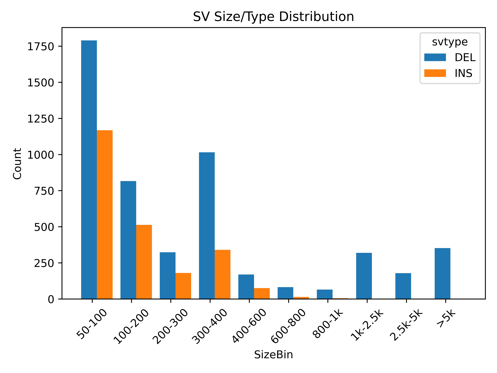
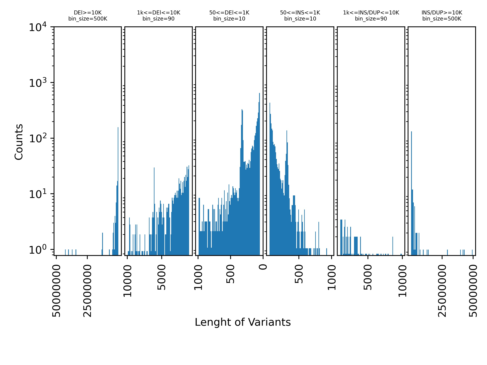
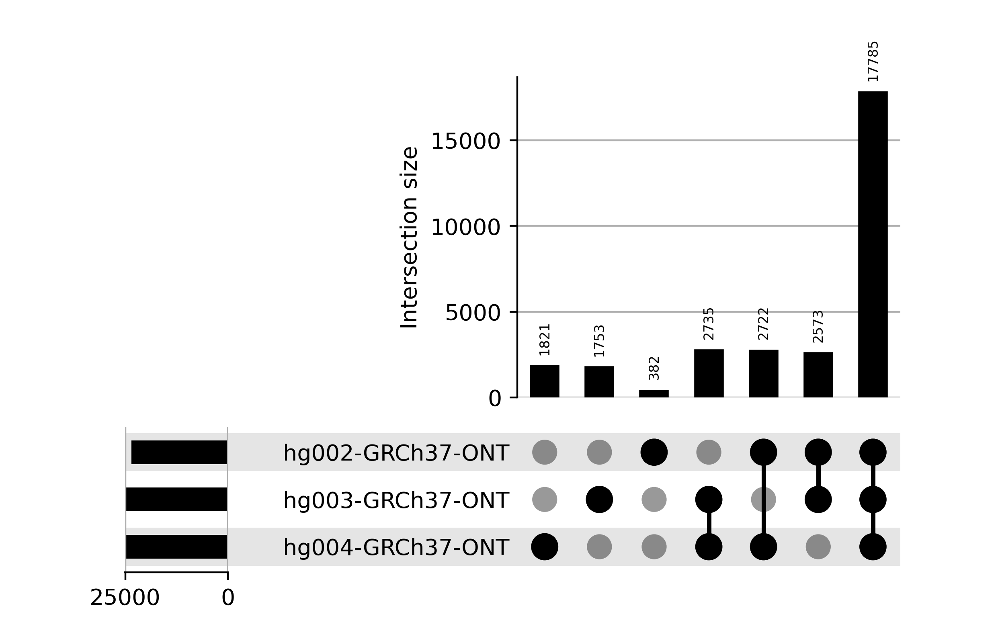

# Sniffles Plot

## Introduction

The Sniffle Plot is a Python program that generates plots for single and multi-sample VCF files.

Type of plots for single sample VCF file:

1. Variant Frequency Spectrum
2. Genotype Frequency
3. SV Size & Type Distribution
4. Comparison of Length of Variants

Type of plots for multi samples VCF file:
    
1. Variant Frequency Spectrum
2. Upset plot for sample intersection
3. SV sites per genome
4. Variant call all SVs
5. Size distribution
6. Heat map for deletion and insertion intersections


## Quick Start
To install this package you can simply run the following command:
```
$ pip3 install sniffles2-plot
```

For running the program for multiple vcf files located in a sepcific directory:
```
$ python3 -m sniffles2_plot -i <VCF_files_folder>
``` 
     
For running the program for a single vcf file:
```
$ python3 -m sniffles2_plot -i <file_name> -o <output_folder>
```
Sample results of output:








